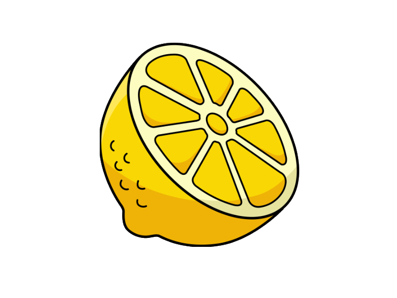

# Cytrus
 A lightweight, Node-Based Serialization Library

## What is Cytrus?
Cytrus provides functionality to Serialize and Deserialize Data in a Tree like hierachy Structure.
It outputs the Serialized Data into a .cyt File which is Human Readable.

There are currently 3 Data Types supported: Strings, Integers and Floats.

## How to use Cytrus:
For a more detailed Example look at Test.cpp for an Example how to work with the nodes.

More coming soon...
